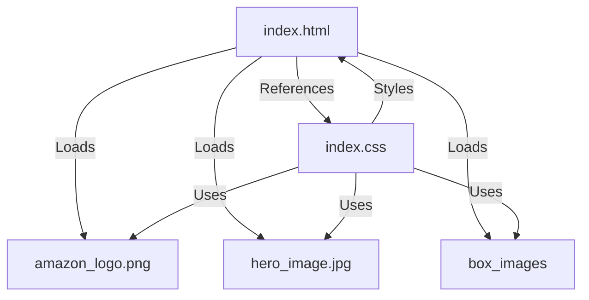

# AMAZON_UI_CLONE
AMAZON UI CLONE


# 🛍️ Amazon UI Clone Project

A pixel-perfect clone of Amazon's e-commerce platform built with HTML and CSS. 

## 🏗️ Project Structure

```
amazon-clone/
├── 📄 index.html
├── 🎨 index.css
├── 🖼️ amazon_logo.png
├── 🌄 hero_image.jpg
└── 📸 box1_image.jpg to box16_image.jpg
```

## 🔧 Technical Implementation Details

### 📱 Header Section
- **🎯 Navigation Bar (`navbar`)**: 
  - Fixed position at top (60px height)
  - Dark background (`#0f1111`) with white text
  - Flex container with evenly spaced elements
  - Interactive hover effects

- **✨ Logo**: 
  - Background image (100px × 50px)
  - Part of main navigation

- **🔍 Search Bar**:
  - Custom-styled dropdown
  - Expandable input field
  - Orange search button
  - Interactive hover effects
  - Width: 625px, Height: 45px

- **🎨 Secondary Navigation Panel**:
  - Height: 40px
  - Darker background (`#222f3d`)
  - Additional navigation options
  - Deals section

### 🌟 Hero Section
- 🖼️ Full-width banner
- Height: 350px
- Bottom-aligned message bar
- Custom-styled links

### 🏪 Shop Section
- 📦 Responsive grid using flexbox
- 🔄 Wrap enabled for responsiveness
- Product Boxes:
  - 📏 23% width (4-column layout)
  - 📐 400px height
  - ⚪ White background
  - 🖼️ 300px image height
  - 🔗 Amazon-blue links

### 👣 Footer Section
Four distinct panels:
1. ⬆️ Back-to-top button
2. 📚 Information links
3. 🏢 Logo section
4. ⚖️ Legal information

Link Sections:
- 📊 Column organization
- 📏 25px line height
- 🎨 Light grey links

## 💅 CSS Features

### 🎨 Key Styling Elements
1. **🔄 Reset Styles**:
   - Zero margins
   - Arial font
   - Border-box sizing

2. **✨ Interactive Elements**:
   - Hover animations
   - Search bar highlights
   - Custom link styling

3. **📐 Layout Techniques**:
   - Flexbox alignment
   - Fixed navigation
   - Responsive grid
   - Background image handling

### 🎨 Color Palette
- 🏴 Navigation: `#0f1111`
- 🌊 Secondary Nav: `#222f3d`
- 🔷 Links: `#007185`
- 🟠 Search Icon: Orange
- ⚫ Footer: Dark gray shades
- ⚪ Text: White & light gray

## 📱 Responsive Design
- 🔄 Flexible grid system
- 📦 Adaptive shop section
- 📌 Fixed navigation
- 🖼️ Scalable images

## 🚀 Getting Started

1. 📥 Clone the repository:
```bash
git clone https://github.com/mdnm18/amazon-clone.git
```

2. 📁 Verify image structure:
   - ✅ `amazon_logo.png`
   - ✅ `hero_image.jpg`
   - ✅ `box1_image.jpg` to `box16_image.jpg`

3. 🌐 Open `index.html` in browser

## 💻 Development Notes

- 🎯 Pure HTML/CSS implementation
- ✨ CSS-powered interactions
- 🖼️ Background image optimization
- 🖥️ Desktop-optimized layout

## 🔗 File Interconnections



## ⚡ Performance Features

- 🚀 Optimized image loading
- ⚡ Minimal CSS approach
- 📱 Responsive design
- 🎨 Efficient styling

## 🤝 Contributing

Feel free to:
- 🐛 Report bugs
- 💡 Suggest features
- 🔀 Submit pull requests

## 📜 License

This project is under the MIT License - see the LICENSE file for details.

## 🙏 Acknowledgments

- 🛍️ Inspired by Amazon's UI/UX
- 🎨 Icons from Font Awesome
- 📐 CSS best practices

---
⭐ Don't forget to star this repo if you found it helpful!
